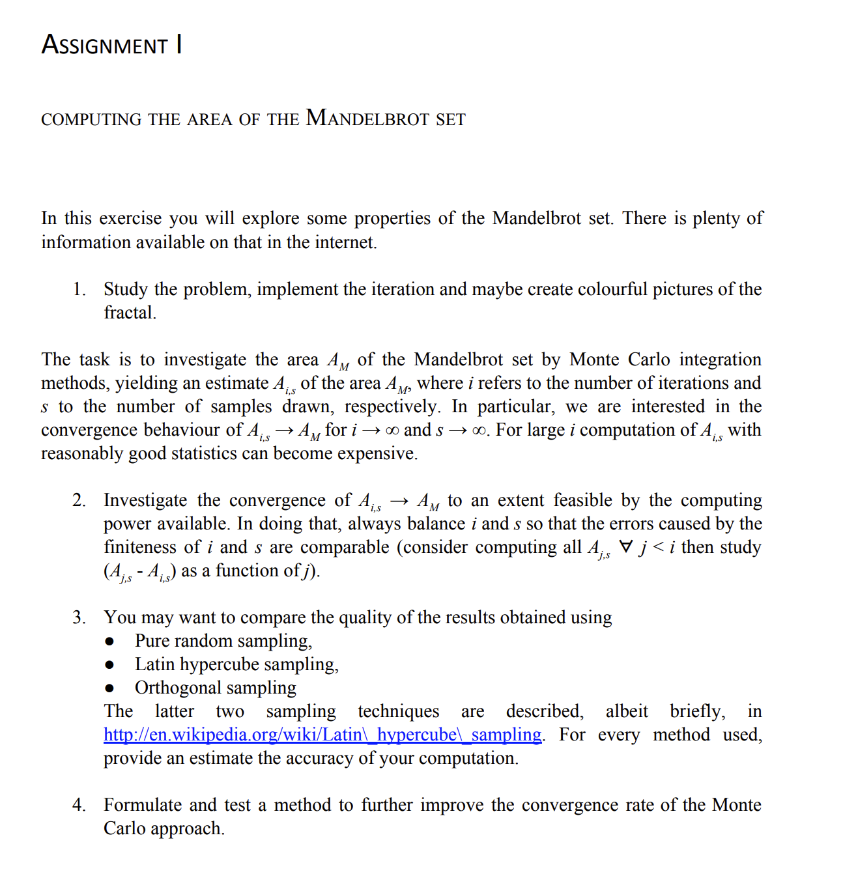

---
# Step 1: Implement Sampling Techniques

**Objective:** Generate 2D sample points within the specified real and imaginary ranges using three sampling techniques.

- **To Do List:**
  - **Pure Random Sampling (`pure_random_sampling`):**
    - Use `numpy.random.uniform()` to generate points within the specified range.
    - Return a set of randomly distributed 2D points.
  - **Latin Hypercube Sampling (`latin_hypercube_sampling`):**
    - Use `scipy.stats.qmc.LatinHypercube` to ensure an even distribution of points.
    - Map generated points to the target range.
  - **Orthogonal Sampling (`orthogonal_sampling`):**
    - Divide the range into a grid and select one point per grid cell.
    - Use nested loops or indexing to ensure orthogonality in sample distribution.

- **Expected Result:** Three functions that each return a set of 2D points within the specified range, providing varying sample distributions.

---

# Step 2: Monte Carlo Integration

**Objective:** Estimate the area \( A_M \) of the Mandelbrot set using Monte Carlo integration.

- **To Do List:**
  - Define a `monte_carlo_area()` function.
  - Accept sampling points and determine if each point belongs to the Mandelbrot set using iteration limits.
  - Calculate the area based on the proportion of points within the Mandelbrot set.

- **Expected Result:** A function that provides an area estimate \( A_{i,s} \) based on any given set of sample points.

---

# Step 3: Convergence Investigation

**Objective:** Test the convergence of area estimates by adjusting sample sizes and iteration counts.

- **To Do List:**
  - Run `monte_carlo_area()` with increasing sample sizes and iterations for each sampling method.
  - Track area estimates \( A_{j,s} \) for all \( j < i \).
  - Calculate and plot \( (A_{j,s} - A_{i,s}) \) to observe convergence behavior.

- **Expected Result:** Visualization of convergence trends, helping to understand how different sampling methods approach the true area \( A_M \).

---

# Step 4: Compare Sampling Methods

**Objective:** Evaluate the quality and efficiency of each sampling technique.

- **To Do List:**
  - Calculate error metrics for each method by comparing results to a known or reference area value.
  - Document accuracy and computational efficiency for each method.
  - Create visualizations to compare the performance of each sampling technique.

- **Expected Result:** Comparison data showing which sampling method offers the best balance of accuracy and efficiency.

---

# Step 5: Further Convergence Improvement

**Objective:** Enhance the Monte Carlo method’s convergence rate with advanced techniques.

- **To Do List:**
  - Implement additional methods, such as stratified or adaptive sampling.
  - Test these methods for improved convergence and document any performance improvements.
  - Integrate and analyze results against the initial sampling methods.

- **Expected Result:** Identification of methods that significantly improve convergence rate, thereby enhancing efficiency in estimating the Mandelbrot set area.

---

**Additional Requirements:**
1. For every method used, provide an estimate of the computation's accuracy.
2. Document and interpret the results, noting any trade-offs between accuracy, computational cost, and convergence rate.
3. ...TBC
